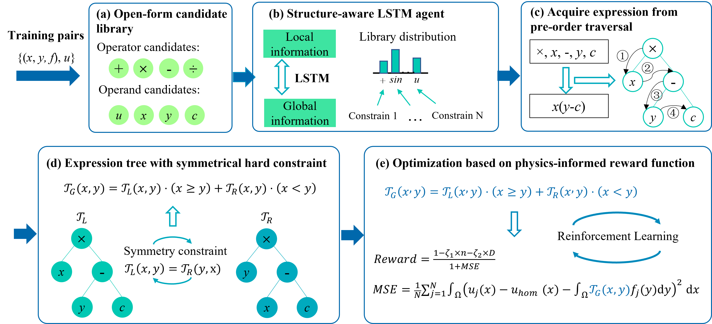

# Discover_Green_function
This repository provides the code and data for following research papers:  
Jianghang Gu, Mengge Du, Yuntian Chen, and Shiyi Chen, Discovery of Green's function based on symbolic regression with physical hard constraints.


# Framework
Overview of the mining of Green's function based on DISCOVER framework:  




# Installation
```
conda create -n env_name python=3.7 # Create a Python 3 virtual environment with conda.
source activate env_name # Activate the virtual environment
```
From the root directory, 
```
pip install --upgrade setuptools pip
export CFLAGS="-I $(python -c "import numpy; print(numpy.get_include())") $CFLAGS" # Needed on Mac to prevent fatal error: 'numpy/arrayobject.h' file not found
pip install -e ./dso # Install  package and core dependencies
```
Extra dependencies,
```
pip install -r requirements.txt # Possible incompatibility may occurs due to the version of tensorboard. Manually installing it may be required.
pip install tensorboard 
```


# Run
 ```
 sh ./script_test/MODE1_test.sh
 sh ./script_test/MODE2_test.sh
 ```


# Reference

(1) DISCOVER: Deep identification of symbolically concise open-form PDEs via enhanced reinforcement-learning. [PDF](https://journals.aps.org/prresearch/abstract/10.1103/PhysRevResearch.6.013182)

(2) https://github.com/dso-org/deep-symbolic-optimization
